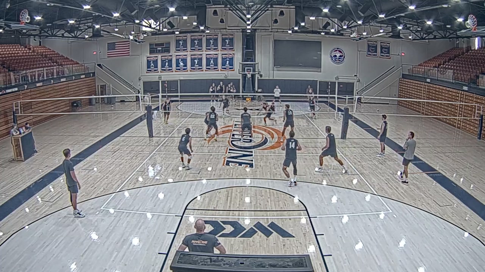
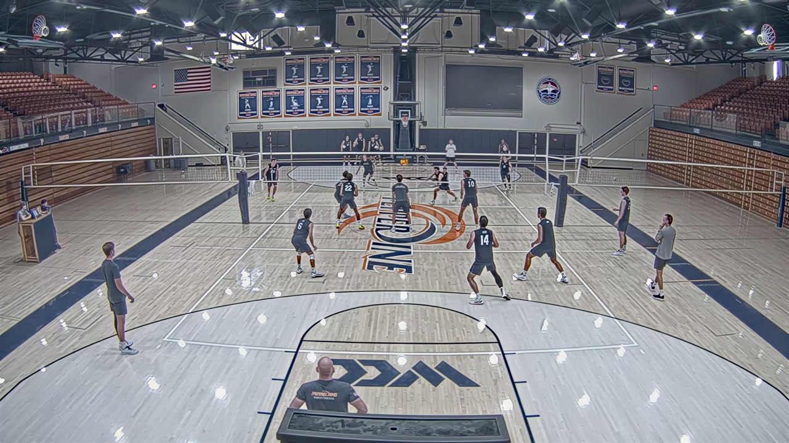
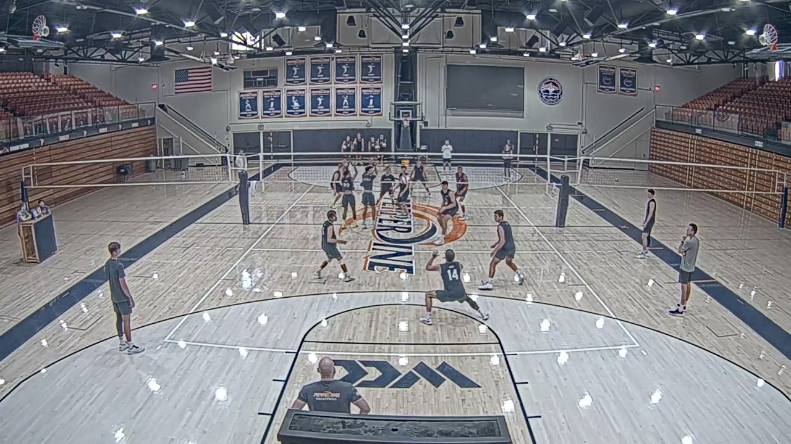
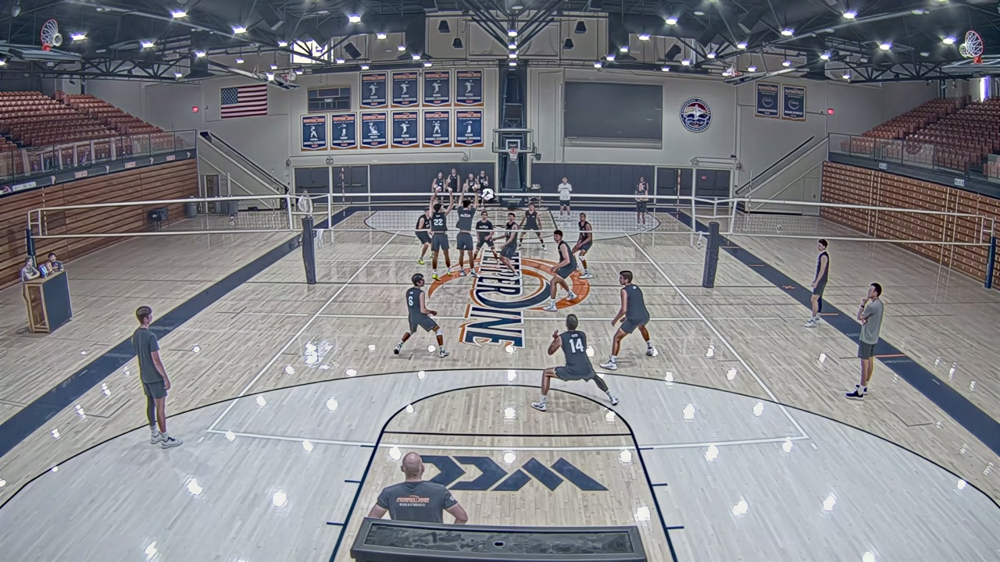
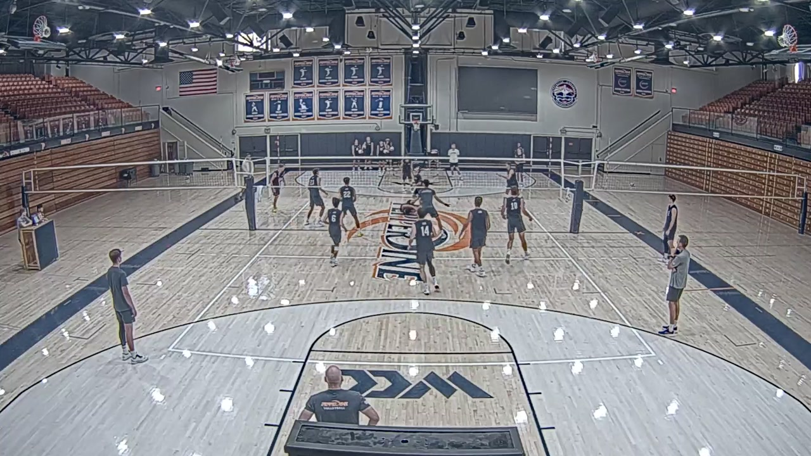
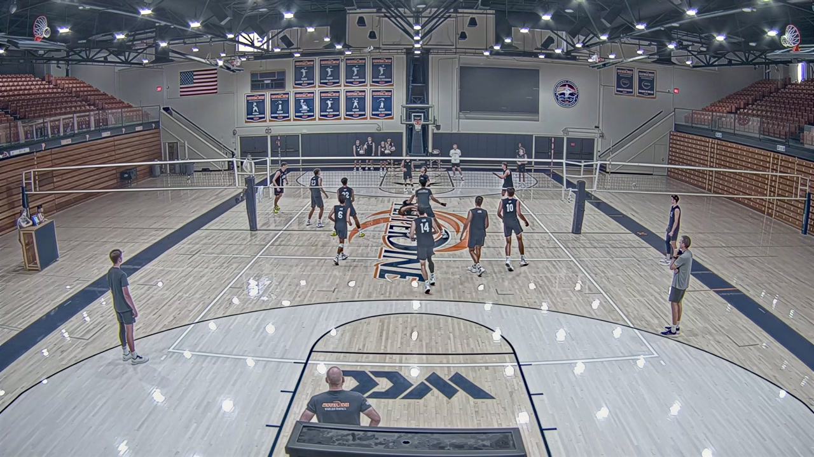

# Volleyball Video Analysis Notebooks + 3D Mesh Viewer

Three notebook-driven pipelines for volleyball footage:

- [`VideoEnhancementPipeline.ipynb`](VideoEnhancementPipeline.ipynb) restores raw match video with SeedVR2 and produces a cleaner `tracking_master_cv.mp4`.
- [`YOLO26_PersonTracker.ipynb`](YOLO26_PersonTracker.ipynb) tracks players frame by frame and exports both `tracked.mp4` and `tracked_tracks.json`.
- [`sam3dbody_video.ipynb`](sam3dbody_video.ipynb) packages a SAM 3D body mesh viewer as `sam3d_viewer.html` plus a `viewer_data/` bundle.

## Live Mesh Viewer

- Deploy this repo from the Vercel dashboard or use the quick import link: [Deploy `volleyball-ui` to Vercel](https://vercel.com/new/clone?repository-url=https://github.com/mazooni/Volleyball-3D-Mesh&project-name=volleyball-3d-mesh&root-directory=volleyball-ui)
- Vercel root directory: `volleyball-ui`
- Suggested project name: `volleyball-3d-mesh`

## Repository Layout

```text
.
├── README.md
├── VideoEnhancementPipeline.ipynb
├── YOLO26_PersonTracker.ipynb
├── sam3dbody_video.ipynb
├── assets/readme/
│   ├── enhancement-before-01.jpg
│   ├── enhancement-after-01.jpg
│   ├── enhancement-before-02.jpg
│   ├── enhancement-after-02.jpg
│   ├── enhancement-before-03.jpg
│   ├── enhancement-after-03.jpg
│   └── yolo-person-tracking.mp4
└── volleyball-ui/
    ├── index.html
    └── 3dmesh/
        ├── sam3d_viewer.html
        └── viewer_data/
```

## 1. `VideoEnhancementPipeline.ipynb`

SeedVR2-based video restoration for low-quality volleyball footage.

- Clones and prepares the SeedVR environment and supporting runtime.
- Builds a constant-frame-rate mezzanine, splits the source video into overlap-aware chunks, and chooses runtime topology from the GPUs it can see.
- Reassembles the restored chunks into a final `tracking_master_cv.mp4`.

### Before / After Frames

Left column is the original clip and right column is the processed output. These frames were sampled from matching moments in the same rally.

<table>
  <tr>
    <th width="50%">Original Input</th>
    <th width="50%">Enhanced Output</th>
  </tr>
  <tr>
    <td width="50%" align="center">
      
    </td>
    <td width="50%" align="center">
      
    </td>
  </tr>
  <tr>
    <td width="50%" align="center">
      
    </td>
    <td width="50%" align="center">
      
    </td>
  </tr>
  <tr>
    <td width="50%" align="center">
      
    </td>
    <td width="50%" align="center">
      
    </td>
  </tr>
</table>

## 2. `YOLO26_PersonTracker.ipynb`

Persistent person detection and ID tracking tuned for the near side of the court.

- Loads `video.mp4`, applies a `-0.55` degree rotation correction, and filters tracking to `KEEP_COURT_SIDE = "near"`.
- Uses `yolo26x.pt` for person detection and `yolo26x-cls.pt` for ReID embeddings through a custom `botsort_reid.yaml`.
- Renders `tracked.mp4` and exports `tracked_tracks.json` with frame-by-frame IDs and boxes.

### Tracking Demo

<p align="center">
  <video src="assets/readme/yolo-person-tracking.mp4" controls muted playsinline loop width="100%"></video>
</p>

<p align="center">
  <a href="assets/readme/yolo-person-tracking.mp4">Open the YOLO person-tracking demo directly</a>
</p>

## 3. `sam3dbody_video.ipynb`

SAM 3D body mesh extraction and viewer export for a volleyball clip.

- Loads `facebook/sam-3d-body-dinov3` and optional helper components such as the human detector and FOV estimator when available.
- Extracts frames from `video.mp4`, runs per-frame body estimation, and serializes the output into chunked mesh data.
- Writes an exported viewer package containing:
  - `sam3d_viewer.html`
  - `viewer_data/manifest.json`
  - `viewer_data/faces.bin`
  - `viewer_data/chunk_*.bin`

The deployable site in [`volleyball-ui/`](volleyball-ui) packages the mesh viewer for Vercel as a standalone 3D experience.

## Deploying the Viewer

1. Import this repo into Vercel Pro.
2. Set the root directory to `volleyball-ui`.
3. If Vercel asks for framework settings, keep it as a static site and deploy.

`volleyball-ui/index.html` is the public entrypoint, and the mesh payload is served from `volleyball-ui/3dmesh/viewer_data/*`.

## Notes

- `assets/readme/` contains still-frame enhancement comparisons plus the tracker demo clip.
- The larger local source videos are intentionally not committed.
- The mesh viewer data is large, so this repo assumes Vercel Pro for a self-contained deployment of the full `viewer_data/` bundle.
